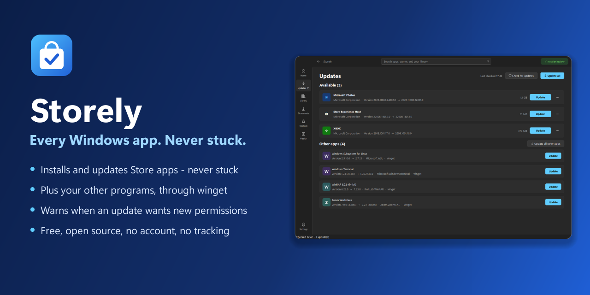
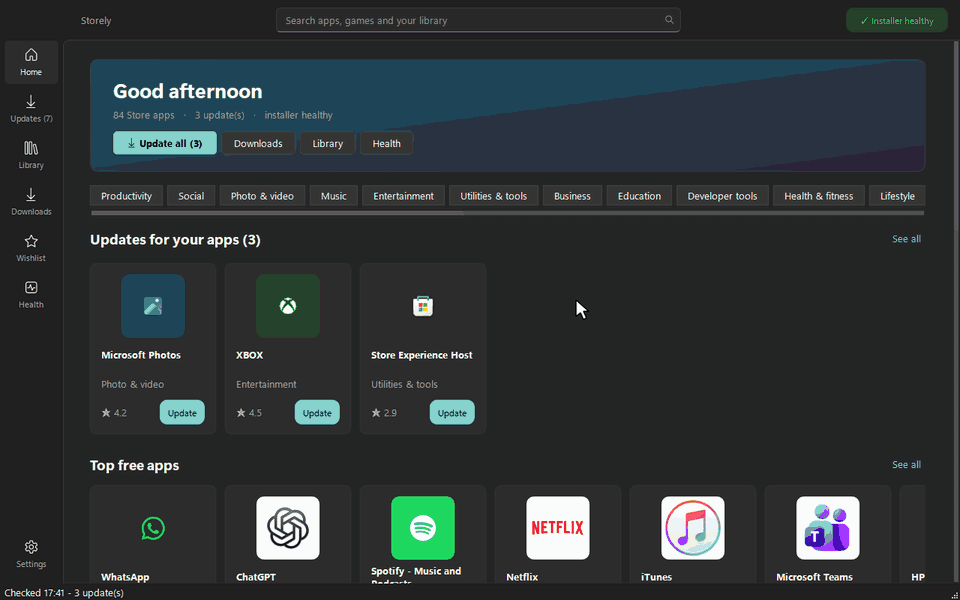
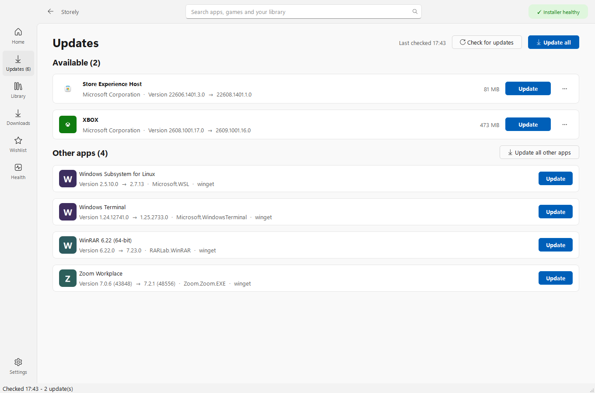
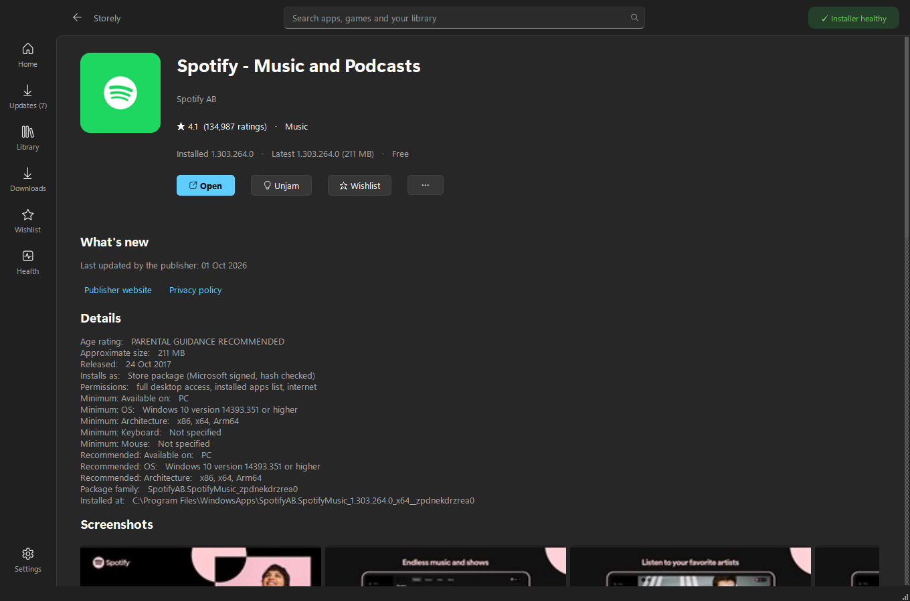
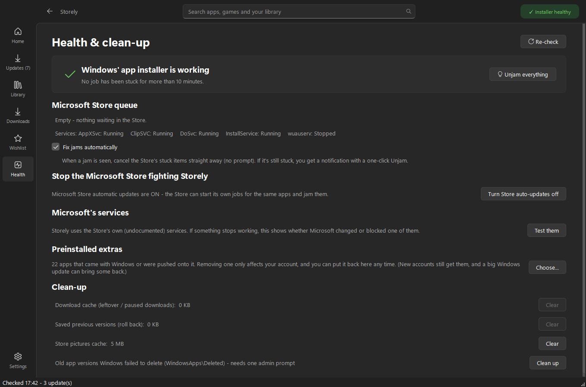
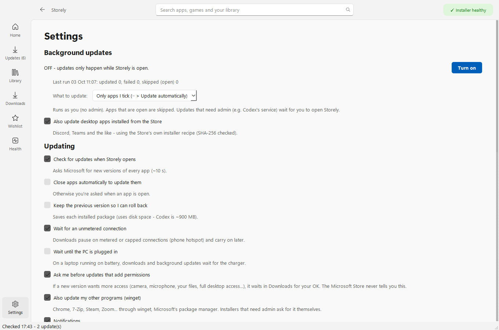

<h3 align="center">The Microsoft Store, but it never gets stuck - and it updates everything else too.</h3>

  
  &nbsp;
  

  
  
  
  

Downloads stuck on **Pending**? Updates that never finish? One frozen app blocking all the others? That's Windows'
app installer jamming - and it reloads the stuck job every time you restart, so rebooting doesn't fix it.

**Storely** gets your apps from the same Microsoft servers the Store uses, but installs them its own way: one at a
time, with a jam detector and a one-click **Unjam** that clears stuck jobs for good. Then it keeps _everything_ up to
date - Store apps and your other programs - from one page.

## Storely vs the Microsoft Store

|                                                             | **Storely**                                         | Microsoft Store                        |
| ----------------------------------------------------------- | --------------------------------------------------- | -------------------------------------- |
| Stuck on "Pending" / updates that never finish              | ✅ One install at a time + **Unjam** that clears it | ❌ Can stay stuck, even after restarts |
| Updates your other programs (Chrome, 7-Zip, Steam, Zoom...) | ✅ Same page, through winget                        | ❌                                     |
| Tells you when an update wants new permissions              | ✅ Waits for your OK (camera, mic, files...)        | ❌ Installs silently                   |
| Install an **older version** of an app                      | ✅                                                  | ❌                                     |
| Hold one app, or skip one bad version                       | ✅ Per app                                          | ❌ All or nothing                      |
| Pause, resume, reorder downloads, speed limit               | ✅                                                  | ❌                                     |
| Save an app to a USB stick for an offline PC                | ✅ With everything it needs                         | ❌                                     |
| Remove preinstalled extras (Candy Crush, Clipchamp...)      | ✅ In one go, with **Put back**                     | One at a time, in Settings             |
| Updates the shared Windows runtimes apps depend on          | ✅ Shown separately                                 | Hidden                                 |
| Paid apps and Game Pass                                     | ❌ Needs a licence only the Store can get           | ✅                                     |
| Free and open source, no account, no tracking               | ✅                                                  | -                                      |

## A closer look

<table>
<tr>
<td width="50%"> <b>Every update in one place.</b> Store apps, the Windows runtimes they need, and your other programs - "Update all" really means all.</td>
<td width="50%"> <b>The whole Store.</b> Charts, categories, search, reviews, screenshots - and a plain list of what each app is allowed to access.</td>
</tr>
<tr>
<td> <b>Spots a jam and clears it.</b> Checks the installer every few minutes, can stop the Store fighting it, cleans up leftovers.</td>
<td> <b>Quietly in the background.</b> Optional updates at sign-in and every 6 hours - as you, never as admin - with quiet hours and wait-for-Wi-Fi/charger.</td>
</tr>
</table>

Also: light and dark themes, holds and rollback, choose the drive apps install to (great for big games), Store links
from websites can open in Storely, export your app list and install it all on a new PC, and a `storely-cli` for
scripting.

## Install

1. **[Download Storely](https://github.com/Ryuu3rs/storely/releases/latest)** - `Storely-Setup-...-x64.exe` for
   most PCs, `-arm64` for Snapdragon/ARM laptops.
2. Run it: Next, Next, Install. Storely goes in the Start menu (right-click it to pin it).

> **"Windows protected your PC"?** Storely is free and its installer isn't code-signed (that costs hundreds a year),
> so Windows doesn't recognise it yet. Click **More info > Run anyway**. Each release has a signed `SHA256SUMS` file
> if you'd like to check you have the genuine download.

Storely updates itself: it tells you when there's a new version and checks the download's signature before
installing it.

## Is it safe?

Yes - and you don't have to take our word for it, the code is all here.

- Store apps only come from Microsoft's own servers, and are checked against Microsoft's fingerprint and signature
  before they install.
- Other programs come through winget, Microsoft's own package manager, which checks each installer too.
- The few things that need admin (like clearing a jam) ask through the normal Windows prompt, and only run code that
  can't be changed without admin rights. Background updates never run as admin.
- No account, no ads, no tracking. Your settings stay on your PC.

Details for the curious: [SECURITY.md](SECURITY.md).

## FAQ

**Do I have to uninstall the Microsoft Store?** No. They live side by side. Storely can switch off the Store's own
automatic updates so the two don't trip over each other (Health page).

**Why can't I get paid apps?** Buying and Game Pass need a licence from your Microsoft account, which only the Store
can get. Free apps - most of the Store - work.

**Is this allowed?** Storely uses the same public services the Store app does, only installs Microsoft-signed
packages from Microsoft, and doesn't get around any licensing. It's an independent project, not made or endorsed by
Microsoft, and Microsoft can change those services at any time (Health > Microsoft's services tests them).

**How do I uninstall it?** Settings > Apps > Storely > Uninstall. It asks whether to keep your settings.

**I used "My Store"** - Storely is its new name. Installing Storely upgrades it and keeps everything.

## Privacy

Nothing is collected. Storely talks to Microsoft's Store and download servers (sending your region, language, Windows
version and the apps it looks up - just like the Store), to winget's sources, to an app's own download server when
you install a desktop app, and to GitHub to check for a new Storely. Everything else stays in
`%LOCALAPPDATA%\Storely` on your PC.

## For developers

- Command line: `storely-cli list | updates | update <app> | queue | health | selftest | export | import`, add
  `--json` for scripting.
- Building and releasing: [CONTRIBUTING.md](CONTRIBUTING.md) (Python 3.12+, PySide6, Inno Setup).
- Thanks to [StoreLib](https://github.com/StoreDev/StoreLib), [rg-adguard](https://store.rg-adguard.net/) and
  [winget](https://github.com/microsoft/winget-cli) - Storely builds on what they figured out.

---

Storely is an independent project, not affiliated with or endorsed by Microsoft. Microsoft, Windows and
Microsoft Store are trademarks of the Microsoft group of companies.
