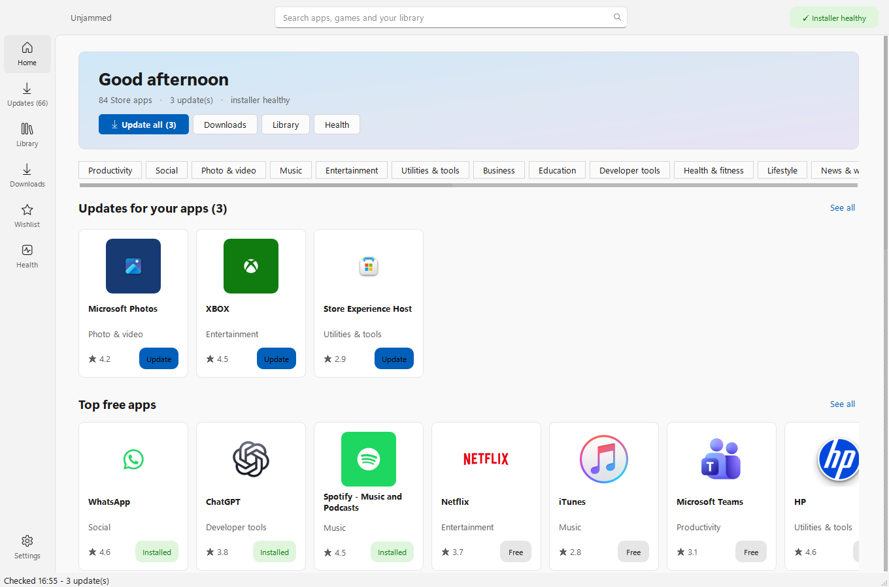
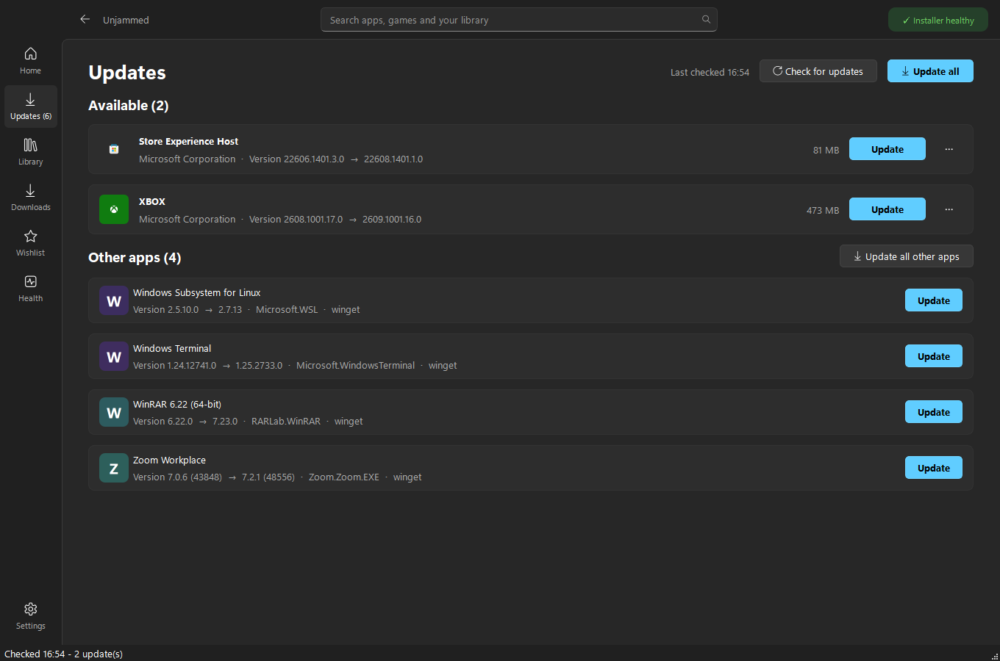

  
  
  
  

**Unjammed installs and updates your Windows apps - Microsoft Store apps and your other programs - without the
Microsoft Store getting stuck.** Free, open source, no account, no tracking.

## Why

If your Store downloads sit at "Pending" forever, updates never finish, or one stuck app blocks all the others, it's
usually not your internet. Windows' app installer works through one queue, and when a job in it hangs, everything
behind it waits. Worse, Windows saves that queue and **reloads the stuck job at every restart**, so rebooting doesn't
fix it. The Microsoft Store also likes to start its own copy of an update you're already installing, and the two
cancel each other out.

Unjammed talks to the same Microsoft services the Store uses - the Store catalogue and the Windows Update servers
that deliver the packages - but runs its own queue: one install at a time across the whole PC, with a jam detector
and a one-click **Unjam** that clears the stuck jobs properly.

## What you get

- **Browse and install** - the full Store: charts, categories, search with filters, app pages with screenshots and
  reviews. Free apps, including the "desktop installer" ones (Discord, Zoom, Teams...).
- **Every update in one place** - Store apps, the Windows runtimes they need, and your other programs (Chrome, 7-Zip,
  Steam, VLC...) through winget. "Update all" really means all.
- **It doesn't jam** - one install at a time PC-wide, pause/resume/reorder downloads, and a Health page that spots a
  stuck installer and unjams it.
- **Permission warnings** - if an update wants more than the version you have (camera, microphone, your files,
  full desktop access), it waits for your OK. The Microsoft Store never tells you this.
- **You stay in control** - hold an app, skip a bad version, install an older version, keep the previous version to
  roll back, choose which drive apps go on, and move apps between drives.
- **Offline copies** - save an app and everything it needs to a USB stick and install it on a PC without internet.
- **Preinstalled extras** - remove Candy Crush, Clipchamp, News and the rest for your account; put them back any time.
- **Quietly in the background** - optional updates at sign-in and every 6 hours, as you (never as admin), with quiet
  hours, wait-for-Wi-Fi and wait-for-the-charger options.
- **Store links open here** (optional) - links to the Microsoft Store, from websites or Windows itself, open in
  Unjammed.

<table>
<tr>
<td></td>
<td></td>
</tr>
<tr>
<td></td>
<td></td>
</tr>
</table>

## Install

1. Download **`Unjammed-Setup-<version>-x64.exe`** from [Releases](https://github.com/Ryuu3rs/unjammed/releases/latest)
   (or the `-arm64` one for Snapdragon/ARM PCs).
2. Run it and click through: Next, Next, Install. It goes into Program Files, adds a Start menu entry, and has an
   uninstaller in Settings > Apps.

**"Windows protected your PC"?** The installer isn't code-signed (that costs hundreds a year), so SmartScreen
doesn't know it yet. Click **More info > Run anyway**. To check you have the real file, compare its SHA-256
(`Get-FileHash .\Unjammed-Setup-*.exe`) with the `SHA256SUMS` file on the release page.

Already installed? Unjammed tells you when a new version is out and updates itself after checking the download's
signature. Installing a new version over the top keeps all your settings.

## Is it safe?

- Store packages are only accepted from Microsoft's servers, must match Microsoft's published digest, and must be
  signed by the Microsoft Store (or Microsoft) for the same publisher as the copy you have. Desktop installers must
  match the SHA-256 in the Store's own install recipe and be validly signed.
- The few things that need admin (clearing a jam, cleaning up old app versions, apps that install a Windows service)
  ask once through the normal Windows prompt, and run code that only admins can change. No scripts are written to
  disk.
- Background updates run as you, never as admin.
- The whole thing is open source. See [SECURITY.md](SECURITY.md) for the details and how to report a problem.

## FAQ

**Does it replace the Microsoft Store?** It does everything most people use the Store for, and the Store can stay
installed alongside it. Turning off the Store's own automatic updates (Health page) stops the two fighting.

**Paid apps and games?** Not supported - those need a licence from your Microsoft account, which only the Store can
get. Free apps (most of the Store) work.

**Is this allowed?** It uses the same public services the Store app does, downloads only Microsoft-signed packages
from Microsoft, and doesn't get around licensing. It is an unofficial tool, not made or endorsed by Microsoft, and
Microsoft can change those services at any time (the Health page has a test for exactly that).

**Uninstalling** - Settings > Apps > Unjammed > Uninstall. It asks whether to keep your settings.

## Privacy

No accounts, analytics or telemetry. Everything stays on your PC in `%LOCALAPPDATA%\Unjammed`. Unjammed talks to
Microsoft's Store and delivery services (sending your region, language, Windows build and the apps it looks up, as
the Store does), to a desktop app's own download server when you install one, to winget's sources, and to GitHub
to check for a new Unjammed.

## Command line

`unjammed-cli list | updates | update <app> [--close] | queue | health | selftest | export <file> | import <file>`,
with `--json` for scripting.

## Building

See [CONTRIBUTING.md](CONTRIBUTING.md). Short version: Python 3.12+, Inno Setup 6, `pwsh -File build.ps1`.

## Thanks

Unjammed stands on work others did to understand the Store's services, especially
[StoreLib](https://github.com/StoreDev/StoreLib), [rg-adguard's Store link generator](https://store.rg-adguard.net/)
and Microsoft's own [winget](https://github.com/microsoft/winget-cli).

---

Unjammed is not affiliated with or endorsed by Microsoft. Microsoft, Windows and Microsoft Store are trademarks of the
Microsoft group of companies.
